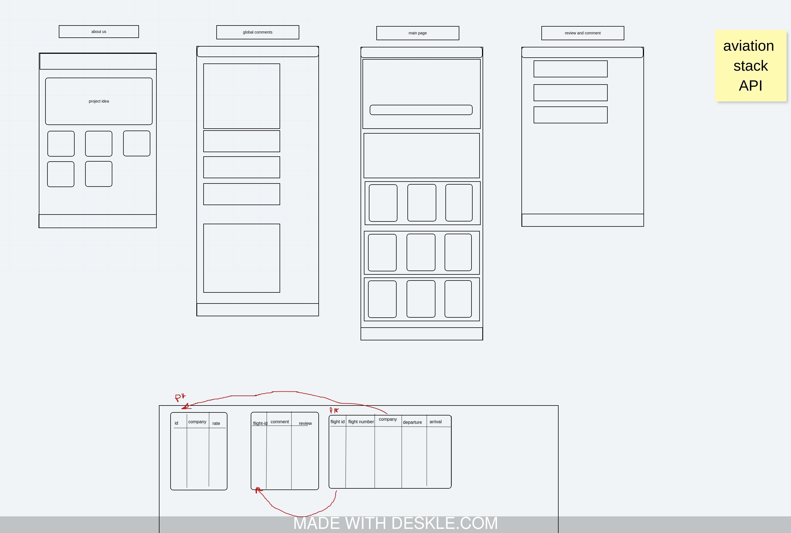
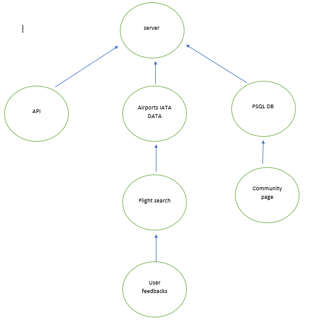

# rahhaleh flights
version: 1.0.0

*by :*
- Ahmad Abuyahya
- Omar alzoubi
- Nizar Alsaeed
- Aya azzam
- Areen jaradat

rahhaleh is a website to search for all flights information such as debarture/arrival, AirLine, flight number, and more!
Also, you can review each flight and see others reviews.

Explore our community to decide about your next flight,check what others have expirenced with the Airline.

each Airline is rated so you can pick up the best one.

frameworks/libraries: 
- node.js
- express
- method_override
- postgres DB
- EJS
- jQuery

API: [aviationstack](https://aviationstack.com/)

dataBase schema available at /data/schema.sql

### User Stories
-   AS a user, i want to search for flights,so that i can check the status of the flight.
-   As a user, i want to have a flexible search for flights using route or flight number.
-   As a user, i want to see what others expirenced with a specifc airline in a large reviewing coummunity.
-   As a user, i want to submit a feedback on my flight, so that i can make sure that my voice is heared.
As a user, i want to see the ratings of the airlines,so that i can pick up the best one.

What is the vision of this product?

rahhaleh is a website to search for all flights information such as departure/arrival, AirLine, flight number, and more! 
you can review each flight and see others reviews.

What pain point does this project solve?

having a community for feedbacks,Explore our community to decide about your next flight, check what others have experienced with the Airline.

Why should we care about your product?

because each Airline is rated so you can pick up the best one.

***see [requirements.md](./requirements.md)***

### WireFrame & DataBase Relations

### Trello

find the project tasks on [Our Trello Borad](https://trello.com/b/cQfUD6ZB/project-301)

### Domain Model

